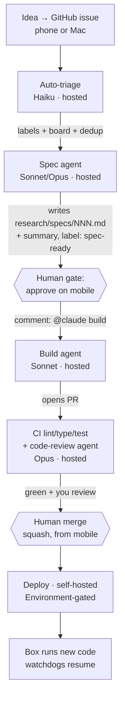

# GitHub-native automation — the operating model for a public, agent-driven repo

*Added 2026-07-17. Standing report / decision input. Scope: how we develop and operate this
project **without the laptop**, using GitHub's free tier (Actions / Issues / Pages / secrets) and
**Claude Code in CI on the Max subscription** for research, spec, build, triage, self-heal, and
box monitoring. Companion to [`free-tier-services.md`](./free-tier-services.md) (runtime/hosting
free tier); this doc is the **automation & agentic layer** on top of it.*

The repo is **public** (`bennetwi92/small-cap-stack`) and runs a **self-hosted `vps` runner** on
the live Hetzner box (CX23, 2 vCPU / 4 GB, holds `.env` + the live IBKR session). That combination
is the axis everything turns on — read §0 first.

**The core inversion:** *silence = healthy.* You stop checking whether the box works. The system is
quiet until a watchdog **opens a GitHub issue**; a new issue in your notifications *is* the alert.

---

## 0. ⚠️ Blocker: public repo + self-hosted runner is a live security hole

> "Self-hosted runners should almost never be used for public repositories, because any user can
> open a pull request and compromise the environment." — [GitHub Docs, secure use][gh-secure]

**The attack:** anyone forks the repo, opens a PR whose workflow sets `runs-on: [self-hosted, vps]`
on a fork-triggerable event, and their code executes **on the trading box** — reaching `.env`, the
IBKR session, and `/data`. This is the default behaviour of a self-hosted runner on a public repo.

**Mitigations (land before any new automation):**
- Never let a fork-triggerable event (`pull_request`, `pull_request_target`, `issue_comment`) run
  on the self-hosted runner. Restrict the VPS runner to `workflow_dispatch` / `push`-to-`main`.
- Guard every self-hosted job with `if: github.repository == 'bennetwi92/small-cap-stack'`.
- Keep **"Require approval for all outside collaborators"** on (public-repo default).
- Run **all Claude / triage / self-heal / monitor jobs on GitHub-hosted runners** — free, ephemeral,
  isolated — never on the VPS.
- Note: since **2026-03-01 self-hosted minutes carry a $0.002/min charge** ([changelog][gh-pricing]).

References: [StepSecurity][stepsec] · [Latchkey][latchkey].

---

## 1. Economics — why this is effectively free

- **Public repos get unlimited free minutes on standard GitHub-hosted runners** ([billing][gh-billing]).
  Only larger/self-hosted runners cost money, so all hosted-runner automation below is $0 compute.
- **Claude in CI runs on the Max subscription, not an API bill.** Run `claude setup-token` locally →
  repo secret **`CLAUDE_CODE_OAUTH_TOKEN`** → `anthropic_api_key: ${{ secrets.CLAUDE_CODE_OAUTH_TOKEN }}`.
  ⚠️ **Do not also set `ANTHROPIC_API_KEY`** — if both are present the API key wins and you get billed
  ([action setup docs][cc-setup]).
- Even on the subscription, **cheaper models spend less quota** → model choice is a real lever (§4).
- Free-on-public security tooling worth enabling regardless: **CodeQL**, **secret scanning + push
  protection**, **Dependabot**.

---

## 2. The four planes — what lives where

| Plane | For | Model | Touches box? |
|---|---|---|---|
| **Mac — local Claude Code** | Heavy/interactive dev, live-IBKR work, box ops (SSH), spikes | Opus 4.8, you-in-loop | Yes (SSH / `docker exec`) |
| **Mobile — Claude Code web/app** | Triage, review + merge PRs, read dashboards, kick off flows by commenting | Opus (interactive) | No |
| **GitHub Actions — Claude-in-CI (Max sub)** | Research, spec, build, review, triage, self-heal, monitor | Haiku/Sonnet/Opus per stage (§4) | Only via guarded deploy jobs |
| **The box (VPS)** | Runtime only. Runs the tracker and *emits* health; never developed on | none | it *is* the box |

**Do you still use mobile Claude Code? Yes — as a control surface, not a workshop.** Read the alert
issue, ask about it, approve a spec, comment `@claude build`, review the diff, squash-merge. The
Mac stays the workshop for messy, IBKR-connected, box-touching work CI structurally can't do (no
live Gateway, no secrets, no SSH from cloud).

---

## 3. The feature pipeline — research → spec → **gate** → build → review → merge → deploy

*Nothing builds until a request is researched, specced, and you've said go.* Six stages, each with an
explicit owner and a hard gate before code exists.

1. **Capture** — you (or an alert, or the overnight analyst) open an issue. One sentence is fine.
2. **Auto-triage** (`issues.opened`, hosted, **Haiku**) — labels, adds to board #3, sets Status,
   links related issues/`decisions.md`, dedups. Cheap, mechanical, no code.
3. **Spec** (label `needs-spec` / comment `/spec`, hosted, **Sonnet**; escalate to **Opus** for
   engine-touching work) — *research only*: reads the relevant `research/` docs + code, writes a
   spec to `research/specs/NNN-title.md` (problem, approach, config knobs to wire, test plan, risks,
   files touched), posts a summary comment, sets label `spec-ready`, and **stops**. No branch, no code.
4. **The gate** — you read the spec on mobile. The one checkpoint that guarantees "fully specced
   before build." Request changes (re-run `/spec`) or approve with `@claude build`.
5. **Build** (hosted, **Sonnet**) — implements strictly against the approved spec, opens a PR, runs
   `make check` in CI.
6. **Review + merge** — `ci.yml` gates + a **code-review agent (Opus)** posts inline findings. You
   skim on mobile, squash-merge. **Deploy** runs on the self-hosted runner behind a GitHub
   **Environment** with a required-reviewer click — a live trading deploy always needs one deliberate
   human tap even when the PR is agent-authored.

The whole chain runs on **free hosted runners against the Max quota**; only stage 6's deploy touches
the box.

---

## 4. Model-efficiency policy

| Stage | Model | Why |
|---|---|---|
| Triage, label, monitor classification, alert-enrichment | **Haiku 4.5** | Mechanical, high-volume, must be cheap |
| Spec research, routine builds, self-heal diagnosis | **Sonnet 5** | Workhorse: good reasoning, moderate cost |
| Engine/strategy specs, architecture, final code review | **Opus 4.8** | Reserve for where a wrong call is expensive |

Two rules that matter more than model choice:
- **Keep steady-state monitoring model-free.** The watchdogs (§5) are plain-Python threshold checks;
  a model is invoked **only when an alert fires**, to enrich/diagnose. This stops monitoring quietly
  draining quota.
- **Gate the spec.** A specced task means the build agent executes rather than explores — cheaper,
  faster, less likely to need a redo.

---

## 5. The two watchdogs — infra + strategy → issues (the Grafana-alert replacement)

Both monitors **open / update / auto-close GitHub issues** instead of lighting a dashboard panel.
Your open `alert`-labelled issues *are* the active-alerts board.

**Box-safe architecture (no box load, no secrets, no SSH):** the app already writes `status.json`
each tick and Pages already publishes data. Publish `status.json` + a small `strategy_health.json`
to the **public Pages site**, and let a **scheduled hosted-runner workflow `curl` them**, evaluate
thresholds in plain Python, and manage issues with `gh` (dedup by stable title, auto-close on
recovery). Belt-and-suspenders liveness: the tick pings a **Healthchecks.io** dead-man's-switch each
cycle (from `free-tier-services.md`).

**Infra watchdog** (every ~5 min during market hours, gated by the trading calendar):
- `status.json` timestamp fresh? (stale ⇒ tick/box dead ⇒ **"box down"**)
- tick duration / missed / over-budget counters (`scs_*`, #327) within budget?
- `scs_dataset_files` file-count explosion (the Parquet cost trap, #318/#319/#321)?
- memory / disk headroom (guard the OOM history, #264/#273)
- self-hosted runner `online`? (the post-OOM offline-queue trap)

**Strategy watchdog** (semantic — "is the tracker doing its job"):
- scanner returning rows during market hours (0 rows for N min ⇒ feed/scanner broken)
- opportunities being captured; EOD batch completing
- feed staleness (the ~15-min-delayed-feed footgun, `phase-2-roadmap.md`)
- opportunity counts / R-metrics within sane historical bands

Each breach ⇒ an issue labelled `infra`/`strategy` + `alert`, deduped so a persistent problem
doesn't spam, **auto-closed when the metric recovers**.

---

## 6. Self-heal — with a hard boundary around the box

When an `alert` issue opens, a self-heal workflow (hosted, **Sonnet**) reads the issue + logs (via
`data-export`) and either:
- **Code-level cause** → opens a fix PR (re-enters the pipeline at review), or
- **Ops-level cause** (restart container, reclaim disk) → posts diagnosis + a *proposed* runbook
  action, but the action is a `workflow_dispatch` behind an **Environment approval**. **An agent
  never autonomously restarts live trading infra** — you tap approve.

---

## 7. A week in the life

- **Mon, phone:** overnight-analyst issue flags a Friday R-capture dip. You reply `/spec — is the
  cons-volume gate too strict?`. Sonnet posts a spec; you read it on the train, `@claude build`; PR
  appears, Opus review is clean, you merge; deploy asks for approval — you tap it.
- **Wed, 10:14 ET:** infra watchdog opens *"tick over budget 3× — scanner_hits file explosion."*
  Self-heal proposes the compaction runbook (#328); you approve; issue auto-closes when files drop.
- **Sat, Mac:** the messy IBKR-connected work — a spike against the live Gateway that CI can't do.
  Full Opus, hands-on.

Four deliberate touches all week; the rest ran on free hosted runners against the Max quota.

---

## 8. Recommended rollout order

**(0) Lock down the self-hosted runner → (1) `CLAUDE_CODE_OAUTH_TOKEN` + `@claude` build agent →
(2) spec-before-build pipeline + gate → (3) auto-triage → (4) infra + strategy watchdogs →
(5) self-heal → (6) overnight analyst → (7) control-plane commands.**

Steps 0–2 deliver the phone-first, spec-gated dev loop; §5 delivers the "I don't have to check the
box" monitoring. Every new job runs on `ubuntu-latest`, never the VPS.

## 9. Open questions

- **Deploy approval gates.** Environment + required reviewer for live deploys — confirmed direction; ok?
- **Token blast radius.** `CLAUDE_CODE_OAUTH_TOKEN` is a long-lived personal credential in repo
  secrets — set a rotation cadence + runbook note.
- **OIDC / short-lived creds.** Can VPS-touching workflows move off long-lived secrets to OIDC?
- **Alert tuning.** What N-minute / band thresholds avoid false alarms without missing real breakage?

---

<!-- links -->
[gh-secure]: https://docs.github.com/en/actions/reference/security/secure-use
[gh-billing]: https://docs.github.com/en/actions/concepts/billing-and-usage
[gh-pricing]: https://github.blog/changelog/2025-12-16-coming-soon-simpler-pricing-and-a-better-experience-for-github-actions/
[cc-setup]: https://github.com/anthropics/claude-code-action/blob/main/docs/setup.md
[stepsec]: https://www.stepsecurity.io/blog/defend-your-github-actions-ci-cd-environment-in-public-repositories
[latchkey]: https://latchkey.dev/learn/ci-how-to/secure-self-hosted-runner-public-repo-github-actions
